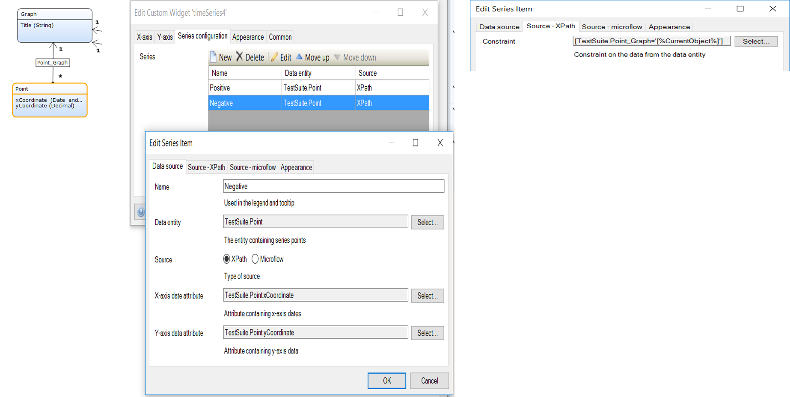

# Time series
Plot and track your data across different time periods on a chart.

## Features
* Plot numeric data date on a time line
* Multiple series in one graph
* Date formatting on x-axis (eg: dd/MM/yyyy, MMM-yyyy). See all patterns [here](http://docs.oracle.com/javase/6/docs/api/java/text/SimpleDateFormat.html) 
* Formatting of numbers on y-axis (decimal precision)
* Guidelines and floating tooltips
* Automatic and custom line colouring eg: # green, #00FF00, rgb(0,255,0)
* Filling of series area

## Dependencies
* Mendix 7.1

## Demo project
https://timeseriestest.mxapps.io/

## Usage
This widget requires a context.

### Series Configuration
Atleast one series is required, with its data source

#### Data source
 - `Name` - The name of the series, it will appear in the chart's legend.
 - `Data entity` - The entity containing the data points for x-axis and y-axis (it has the x and y attributes). In this example its the <b>Point</b> entity.
 - `Source`
    * XPath - For "XPath" source, add an XPath constraint in the `Source - XPath` tab.
    * Microflow - For "Microflow" source, add a data source microflow in the `Source - Microflow` tab.
#### Sample domain model and configuration

## Issues, suggestions and feature requests
We are actively maintaining this widget, please report any issues or suggestion for improvement at https://github.com/mendixlabs/time-series/issues.

## Development
Prerequisite: Install git, node package manager, webpack CLI, grunt CLI, Karma CLI

To contribute, fork and clone.

    > git clone https://github.com/mendixlabs/time-series.git

The code is in typescript. Use a typescript IDE of your choice, like Visual Studio Code or WebStorm.

To set up the development environment, run:

    > npm install

Create a folder named `dist` in the project root.

Create a Mendix test project in the dist folder and rename its root folder to `dist/MxTestProject`. Changes to the widget code shall be automatically pushed to this test project.

To automatically compile, bundle and push code changes to the running test project, run:

    > grunt

To run the project unit tests with code coverage, results can be found at `dist/testresults/coverage/index.html`, run:

    > npm test

or run the test continuously during development:

    > karma start
